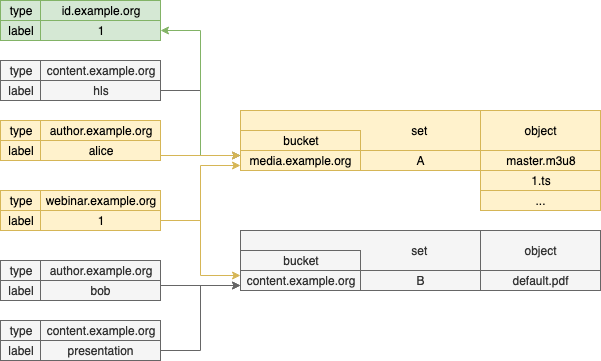
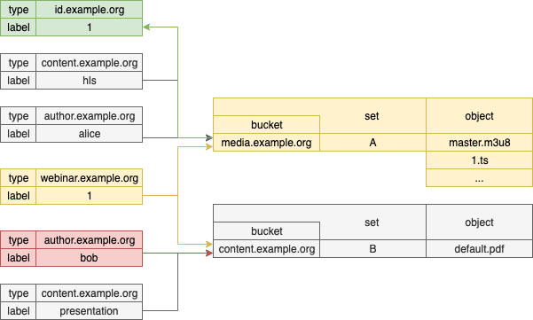

# List

Retrieve a list of tags.

**URI**

```
GET /tags
```

**Query string parameters**

Name     | Type   | Default    | Description
-------- | ------ | ---------- | ------------------
filter   | Bucket | _required_ | Returns only tags of the specified type.
include  | [Tag]  | _required_ | Queried sets should have tags from this list.
exclude  | [Tag]  | _optional_ | Queried sets shouldn't have tags from this list.
offset   | Int    | _optional_ | Returns only objects starting from the specified index.
limit    | Int    |         25 | Limits the number of objects in the response.

**Response**

If successful, the response contains a list of `Tag` objects.

**Example - A**

It shows how to query all the content within particular **webinar id** and that **created by Alice**. Results are filtered by specified tag that may be used later to access any object of the tagged set.

```bash
curl -fsSL \
    -XGET ${ENDPOINT}/tags?filter=id.example.org&include=author.example.org::alice,webinar.example.org::1 \
    -H "authorization: Bearer ${ACCESS_TOKEN}"

[
    "id.example.org::1"
]
```



**Example - B**

It shows how to query all the content within particular **webinar id** and that **wasn't created by Bob**. Results are filtered by specified tag that may be used later to access any object of the tagged set.

```bash
curl -fsSL \
    -XGET ${ENDPOINT}/tags?filter=id.example.org&include=webinar.example.org::1&exclude=author.example.org::bob \
    -H "authorization: Bearer ${ACCESS_TOKEN}"

[
    "id.example.org::1"
]
```


